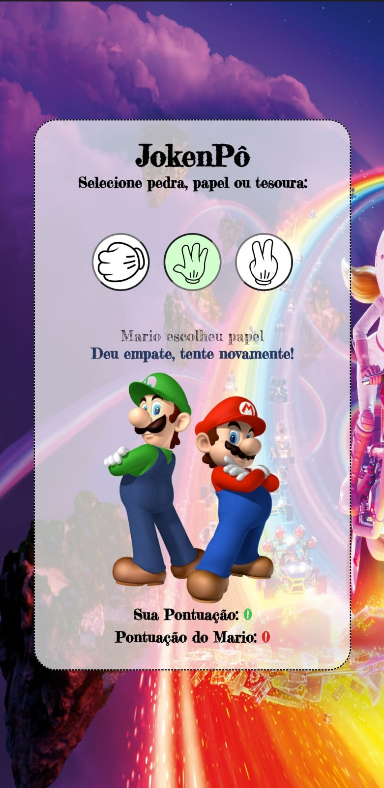
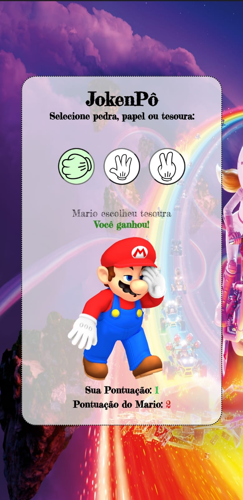
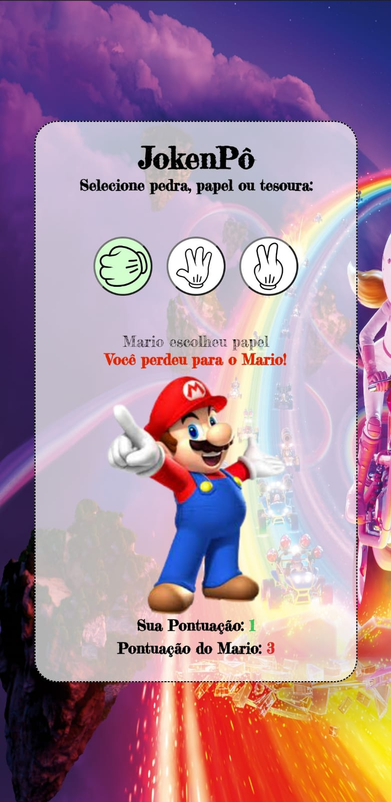

  <h1>JokenPô</h1>
  
  
Bem-vindo ao JokenPô, um jogo de Pedra, Papel e Tesoura onde você pode jogar contra o Mario e ver quem é o vencedor! Este é um projeto simples desenvolvido em HTML, CSS e JavaScript.

  
  
As pontuações de cada jogador (você e o Mario) são mostradas em cores diferentes, para distingui-las facilmente.

O jogo também possui uma versão responsiva, ajustando-se automaticamente a diferentes tamanhos de tela para proporcionar uma experiência consistente em dispositivos móveis e desktops.

## Como Jogar

 Acesse o jogo através do link: [JokenPô - Jogar Agora](https://gabrielabade.github.io/pedra_papel_tesoura/)

 Ao entrar na página, você verá um fundo temático com o Mario. Ele é o seu adversário neste jogo.

 Seu objetivo é escolher uma das três opções disponíveis: Pedra, Papel ou Tesoura. Para isso, clique em um dos botões correspondentes à sua escolha.

 O Mario também fará sua escolha aleatoriamente.

 O resultado do jogo será exibido logo abaixo dos botões, mostrando se você venceu, perdeu ou empatou.

 A pontuação será atualizada a cada rodada, mostrando quantas vezes você e o Mario venceram.

## Tecnologias Utilizadas

  
  
  
  
  ## Demonstração
  

